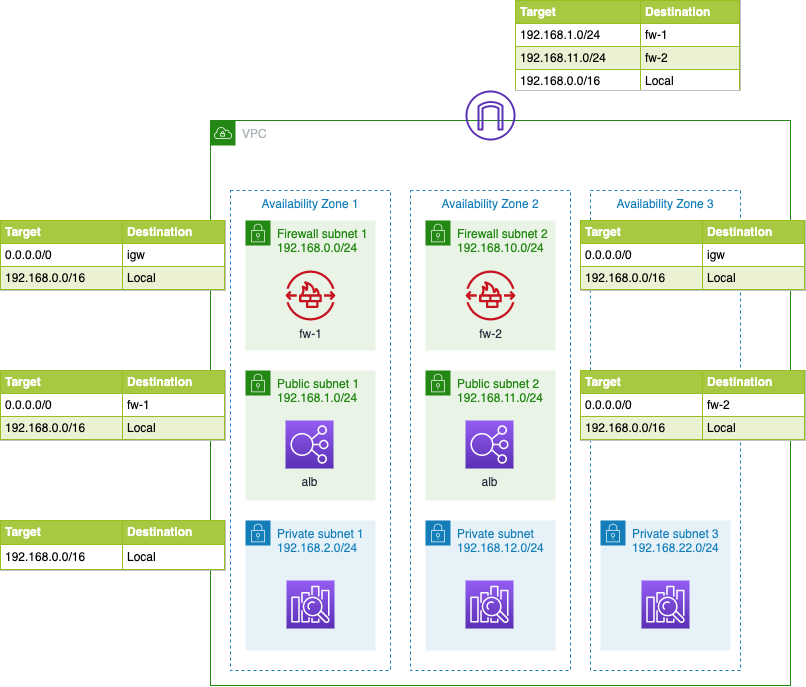
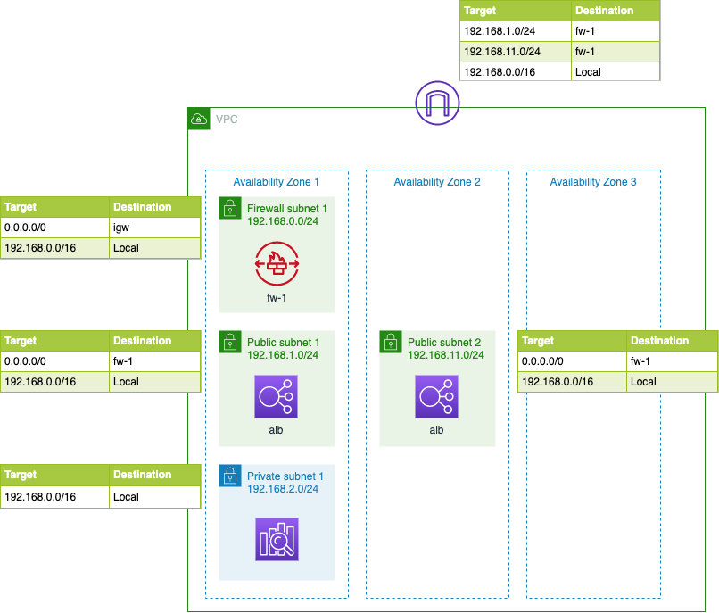
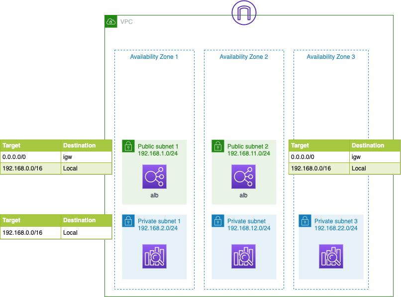
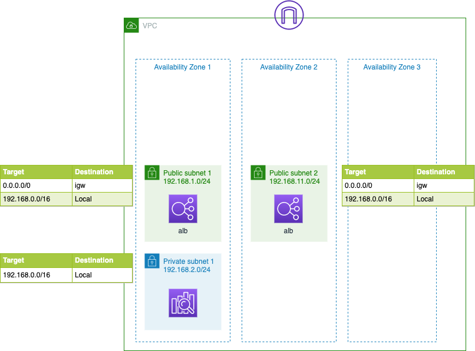

# aws-vpc-amazon-es-example

AWS CloudFormation example templates which creates VPC resources for Amazon Elasticsearch Service in VPC. If you deploy Amazon ES in VPC, you need to setup some AWS resources to access it from Internet. Amazon ES instances sometimes change IP address. Then you need to maintain accessbility. This example resolves this isseue. EventBridge detects Amazon ES instance changing and Lambda function updates target group with new ip addresses.
This cloudformation don't depoloy Amazon ES instances.

## Usage

1. Create SSL certificate with AWS Certificae Manger for ALB
2. Deploy with this CloudFormation Stack
3. Deploy Amazon ES domain
4. Optional) Set custom endpoint and dns.
5. HTTPS Access ALB address to access kibana

## Architecture Example

### ALB, NFW, Amazon ES in multi AZ



### ALB, NFW, Amazon ES in single AZ



### ALB, Amazon ES in multi AZ



### ALB, Amazon ES in single AZ



## Create CloudFormation Template with CDK

```bash
cd glone 
mkdir templates
source .venv/bin/activate
pip3 install -r requirements.txt
cdk synth vpc-multi-az          --path-metadata false > cloudformation_template/vpc-multi-az.template
cdk synth vpc-multi-az-with-fw  --path-metadata false > cloudformation_template/vpc-multi-az-with-fw.template
cdk synth vpc-single-az         --path-metadata false > cloudformation_template/vpc-single-az.template
cdk synth vpc-single-az-with-fw --path-metadata false > cloudformation_template/vpc-single-az-with-fw.template
```
